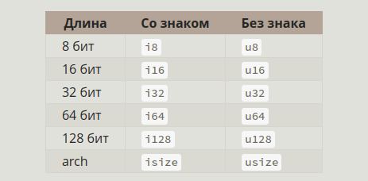

04-05.03.23, Белград

Актуальная версия: Rust 1.65 (выпущен 03.11.2022)  
Сборка документации: https://github.com/rust-lang/mdBook

## Предисловие

Программисты, которым необходимо «погрузиться» в низкоуровневое управление,
могут сделать это с помощью Rust, не беря на себя привычный риск аварий или
дыр в безопасности и не изучая тонкости изменчивых наборов инструментов.
Более того, язык предназначен для того, чтобы легко вести вас к надёжному коду,
который эффективен с точки зрения скорости и использования памяти

## Введение

Rust зарекомендовал себя как продуктивный инструмент для совместной работы больших
команд разработчиков с разным уровнем знаний в области системного программирования

- менеджер зависимостей Cargo делает добавление, компиляцию и управление зависимостями безболезненным и согласованным в рамках всей экосистемы Rust
- Инструмент форматирования Rustfmt обеспечивает единый стиль кодирования для всех разработчиков
- Rust Language Server обеспечивает интеграцию с интегрированной средой разработки (IDE) для автодополнения кода и встроенных сообщений об ошибках

Главная цель Rust - избавиться от компромиссов, на которые программисты шли десятилетиями,
обеспечив безопасность и производительность, скорость и эргономичность

Ferris - краб маскот Rust

# 1. Установка и основы

    curl --proto '=https' --tlsv1.3 https://sh.rustup.rs -sSf | sh

- rustup  - утилита для установки и управления версиями Rust + документация (`rustup doc --std std::mem`)
- rustc   - компилятор
- rustfmt - форматирование
- cargo   - пакетный менеджер, по сути оборачивающий всё остальное

Создание проекта, компиляция и запуск:

    cargo new hello_cargo && cd hello_cargo

    # Функция main - точка входа в каждой исполняемой программе Rust
    fn main() {
        # ! означает, что используется макрос, а не функция
        println!("Hello, world!");
    }

    cargo build - собрать dev версию
    cargo build --release - собрать prod версию
    cargo run - собрать и запустить
    cargo check - проверить на работоспособность без полной сборки
    cargo update - обновить зависимости
    cargo doc --open - сборка документации

> см. projects/hello_cargo

# 2. Проект: игра в загадки

программа генерирует случайное целое число в диапазоне от 1 до 100. Затем она предлагает
игроку его угадать. После ввода числа программа укажет, меньше или больше было загаданное число.
Если догадка верна, игра напечатает поздравительное сообщение и завершится

> см. projects/guessing_game

# 3. Общие концепции

Константы всегда неизменяемы и явно типизированы, могут быть указаны в любом скопе.
Вот что может быть вычислено в константе: https://doc.rust-lang.org/stable/reference/const_eval.html

Скалярные типы данных: целые и вещественные числа, логический тип и символы

Способы записи чисел

### Обработка переполнения целых чисел

Чтобы явно обработать возможность переполнения, можно использовать следующие группы методов:
- Обёртывание во всех режимах с помощью методов wrapping_*, например wrapping_add
- Верните значение None, если произошло переполнение при использовании методов checked_*
- Верните число и логическое значение, указывающее, имело ли место переполнение с помощью методов overflowing_*
- Считать корректным установку минимального или максимального значения, используя метод saturating_*

C плавающей точкой есть 2 типа - f32 и f64 (по умолчанию)

Логический тип в Rust может иметь два значения: true и false и занимает в памяти один байт

Тип char в Rust — самый примитивный алфавитный тип языка.
Он имеет размер четыре байта и представляет собой скалярное значение Unicode

    fn main() {
        let c = 'z';
        let z: char = 'ℤ'; // with explicit type annotation
        let heart_eyed_cat = '😻';
    }

### Сложные типы данных: кортежи и массивы

**Кортеж** является общим способом совместной группировки нескольких значений различного типа в единый
комбинированный тип. Кортежи имеют фиксированную длину: после объявления они не могут расти или
уменьшаться в размере

Чтобы получить отдельные значения из кортежа, можно использовать сопоставление с образцом для
деструктурирования значений кортежа

    let tup: (i32, f64, u8) = (500, 6.4, 1);
    let (x, y, z) = tup;
    // x = tup.0

Кортеж без каких-либо значений имеет специальное имя unit. Это значение и соответствующий ему тип
записываются как () и представляют собой пустое значение или пустой возвращаемый тип.
Выражения неявно возвращают unit, если они не возвращают никакого другого значения

Каждый элемент **массива** должен иметь один и тот же тип. В отличие от массивов в некоторых других языках,
массивы в Rust имеют фиксированную длину

    let a: [i32; 5] = [1, 2, 3, 4, 5]; // аннотация указывает тип и размер
    let b = [3; 5]; // b = [3, 3, 3, 3, 3];

Массивы полезны, когда вы хотите, чтобы ваши данные размещались в стеке, а не в куче, или когда вы хотите,
чтобы у вас всегда было фиксированное количество элементов. Однако массив не такой гибкий, как векторный тип.
Вектор — это аналогичный тип коллекции, предоставляемый стандартной библиотекой, размер которого может
увеличиваться или уменьшаться. Если вы не уверены, использовать массив или вектор, скорее всего,
вам следует использовать вектор

Массив — это единый фрагмент памяти известного фиксированного размера, который может быть размещён в стеке

### Функции

Код Rust использует **snake_case** как основной стиль для имён функций и переменных. Порядок объявления не важен,
указание типов обязательно

    fn main() {
        println!("Hello, world!");
        print_labeled_measurement(5, 'h');
    }
    
    fn print_labeled_measurement(value: i32, unit_label: char) {
        println!("The measurement is: {value}{unit_label}");
    }

Тела функций состоят из ряда операторов, необязательно заканчивающихся выражением.
**Операторы** - это инструкции, которые выполняют какое-либо действие и не возвращают значение.
**Выражения** вычисляют результирующее значение

Вызов функции - это выражение. Вызов макроса - это выражение. Новый блок области видимости, созданный с помощью
фигурных скобок, представляет собой выражение, например:

    fn main() {
        let y = {
            let x = 3;
            x + 1
        };
        println!("The value of y is: {y}");
    }

Важно! Выражения не включают точку с запятой в конце. Если ее поставить, получается оператор, т.е. отсутствует
возвращаемое значение

Функции могут возвращать значения коду, который их вызывает. Мы не называем возвращаемые значения,
но мы должны объявить их тип после стрелки ( -> ). В Rust возвращаемое значение функции является
синонимом значения конечного выражения в блоке тела функции. Вы можете раньше выйти из функции и
вернуть значение, используя ключевое слово return и указав значение, но большинство функций неявно
возвращают последнее выражение

    fn five() -> i32 {
        5
    }

### Комментарии

В Rust есть 2 типа комментариев: обычные (//) и документирующие (///)

### Управляющие конструкции

    fn main() {
        let number = 3;
    
        if number < 5 {
            println!("condition was true");
        } else {
            println!("condition was false");
        }

        let condition = true;
        let number = if condition { 5 } else { 6 };
        println!("The value of number is: {number}");
    }

В Rust есть три вида циклов: loop, while и for.  
Из цикла можно вернуть значение, как если бы это была функция:

    fn main() {
        let mut counter = 0;
        let result = loop {
            counter += 1;
    
            if counter == 10 {
                break counter * 2;
            }
        };
        println!("The result is {result}");

        let a = [10, 20, 30, 40, 50];
        for element in a {
            println!("the value is: {element}");
        }

        for number in (1..4).rev() {
            println!("{number}!");
        }
    }

Цикл можно снабдить меткой (вида **'outer: loop {**), чтобы ссылаться на него при использовании **break**

# Практика

- Конвертация температур между значениями по Фаренгейту к Цельсию
- Генерирование n-го числа Фибоначчи
- Распечатайте текст рождественской песни "Двенадцать дней Рождества", воспользовавшись повторами в песне
