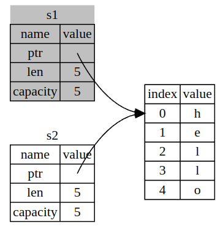
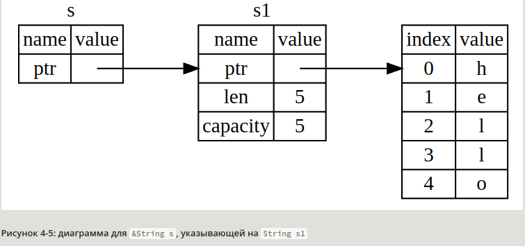

11.03.23, Белград

## Владение

Владение - это самая уникальная особенность Rust, которая имеет глубокие последствия для всего языка.
Это позволяет Rust обеспечивать безопасность памяти без использования сборщика мусора, поэтому важно понимать,
как работает владение

Память, используемая программой, делится на стек и кучу. Куча используется для динамически выделяемой памяти,
и как правило, работа с ней более медленная. Владение позволяет более оптимально использовать кучу и эффективно
автоматически очищать память

- У каждого значения в Rust есть владелец (переменная или функция)
- У значения может быть только один владелец в один момент времени
- Когда владелец покидает область видимости, значение удаляется

Для иллюстрации владения возьмем тип String - сама переменная храниться в стеке, но ссылается на область памяти
в куче для хранения изменяемого значения

    let mut s = String::from("hello");
    s.push_str(", world!");
    println!("{}", s);

Когда владелец покидает область видимости, у него автоматически вызывается метод Drop, отвечающий за освобождение
памяти (в C++ этот паттерн называется RAII)

### Перемещение

Перемещение - это поверхностное копирование + удаление старой переменной.

    let s1 = String::from("hello");
    let s2 = s1;

Длина — это количество байт памяти, которое использует содержимое String в данный момент.
Ёмкость — это общее количество байт памяти, которое String получил от операционной системы.
Разница между длиной и ёмкостью имеет значение, но не в данном контексте — сейчас можно игнорировать ёмкость

Когда переменная s2 и переменная s1 выходят из области видимости, они обе будут пытаться освободить одну и ту же
память в куче. Чтобы обеспечить безопасность памяти, после строки **let s2 = s1** Rust считает s1 более недействительным.
Rust никогда не будет автоматически создавать «глубокие» копии ваших данных

### Клонирование

Глубокое копирование можно осуществить методом clone

    let s1 = String::from("hello");
    let s2 = s1.clone();

Использование clone является визуальным индикатором того, что тут происходит что-то нестандартное
(глубокое копирование вместо обыденного перемещения)

Явное клонирование не нужно для переменных, данные которых полностью храняться в стеке. Для этого тип
переменной должен использовать типаж Copy. Тип не может одновременно реализовать Drop и Copy

### Функции

С аргументами функций владение работает аналогично

    fn main() {
        let s = String::from("hello");
        takes_ownership(s);
        // здесь s уже нельзя использовать - новый владелец очистил память
        let x = 5;
        makes_copy(x);
        // x можно использовать, т.к. x - стековая
    }

Возвращаемые значения также передают право владения. **s = takes_ownership(s);** позволило бы использовать
**s**, т.к. владение бы вернулось обратно

## Ссылки

Ссылка похожа на указатель в том смысле, что это адрес, по которому мы можем проследовать, чтобы получить
доступ к данным, хранящимся по этому адресу; эти данные принадлежат какой-то другой переменной.
В отличие от указателя, ссылка гарантированно указывает на допустимое значение определённого типа
в течение всего срока существования этой ссылки

Мы называем процесс создания ссылки заимствованием. Как переменные неизменяемы по умолчанию, так и ссылки.
Нам не разрешено изменять то, на что у нас есть ссылка. Вот так можно сделать ссылку изменяемой:

    fn main() {
        let mut s = String::from("hello");
        change(&mut s);
    }
    
    fn change(some_string: &mut String) {
        some_string.push_str(", world");
    }

Если создана 1 изменяемая ссылка, больше никаких ссылок на эту переменную создать нельзя.
Преимущество этого ограничения заключается в том, что Rust может предотвратить гонку данных во время компиляции

Из функции не получится вернуть ссылку на то, что создано внутри функции - так может получиться "висячая" ссылка,
ни на что не указывающая, поэтому этот код не скомпилируется:

    fn main() {
        let reference_to_nothing = dangle();
    }
    
    fn dangle() -> &String {
        let s = String::from("hello");
        &s
    }

## Срезы

Срезы позволяют ссылаться на непрерывную последовательность элементов в коллекции, а не на всю коллекцию.
Срез является своего рода ссылкой, поэтому он не имеет права владения

Задача: получить индекс конца первого слова в строке

    fn first_word(s: &String) -> usize {
        let bytes = s.as_bytes();
    
        for (i, &item) in bytes.iter().enumerate() {
            if item == b' ' {
                return i;
            }
        }
    
        s.len()
    }

Проблема этого решения в том, что найденый индекс никак не связан с оригинальным String

    fn main() {
        let mut s = String::from("hello world");
        let word = first_word(&s);
        s.clear();
        // word = 5, но строка пустая
    }

Для такого случая удобно использовать строковый срез

    let s = String::from("hello world");
    let hello = &s[..5];
    let world = &s[6..];

Перепишем метод, с возвратом строкового среза

    fn first_word(s: &str) -> &str {
        let bytes = s.as_bytes();
    
        for (i, &item) in bytes.iter().enumerate() {
            if item == b' ' {
                return &s[0..i];
            }
        }
    
        &s[..]
    }

На самом деле, все строковые литералы - это срезы

    let s = "Hello, world!";  // s: &str

Срез на массивах

    let slice = &a[1..3];

### Итоги

Концепции владения, заимствования и срезов обеспечивают безопасность памяти в программах на
Rust во время компиляции. Язык Rust даёт вам контроль над использованием памяти так же,
как и другие языки системного программирования, но то, что владелец данных автоматически очищает эти данные,
когда владелец выходит за рамки, означает, что вам не нужно писать и отлаживать дополнительный код,
чтобы получить этот контроль